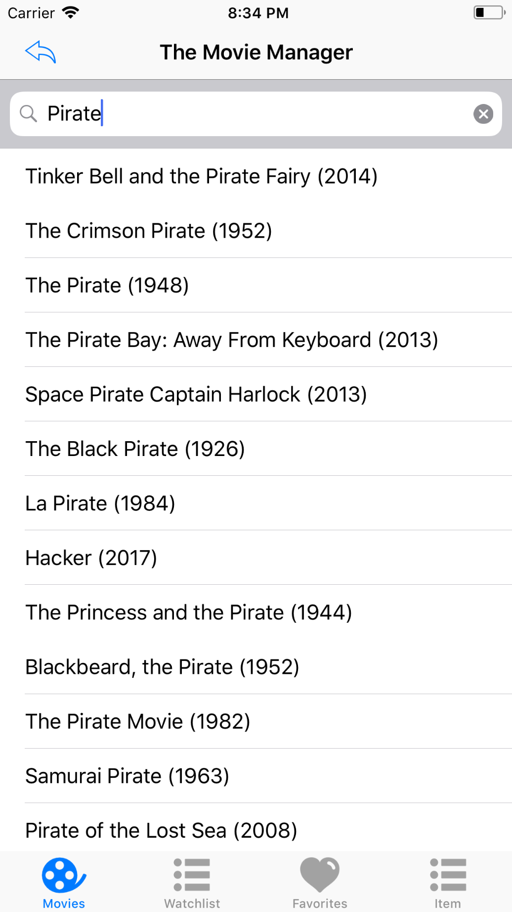
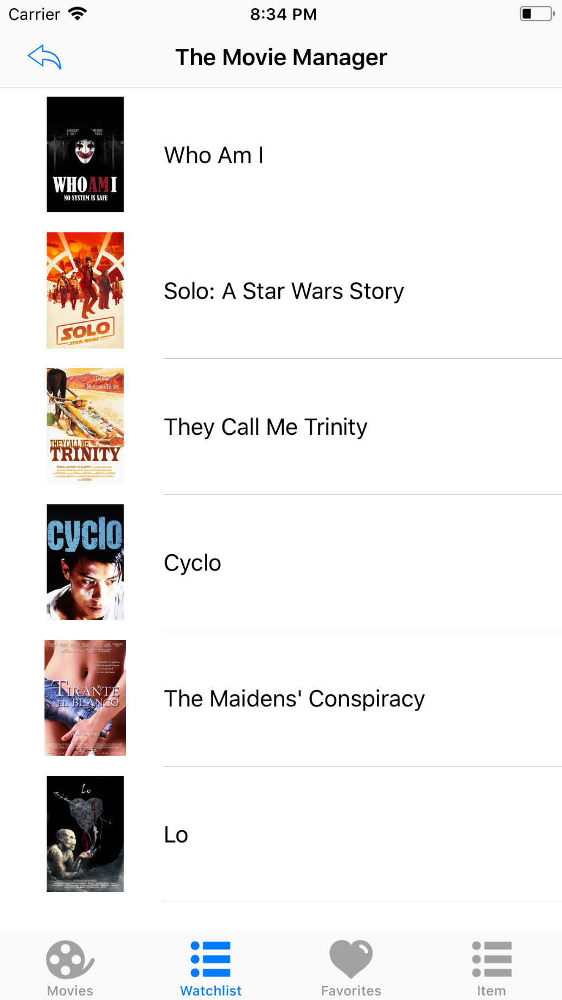
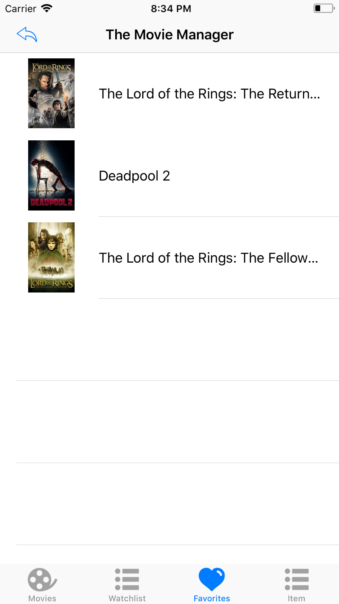

<p align="center">
  
</p>

<a href="https://developer.apple.com/swift/" target="_blank">
  
</a>

<a href="https://www.udacity.com/course/ios-developer-nanodegree--nd003" target="_blank">
  
</a>  

# Movie Manager 

Here is a fully functional and colorful iOS app which I made from scratch for iOS Developer Nanodegree program. This app reveals the power of adaptive UI both for phone and tablet devices.
This App is the Final Project for Networking Course from <a href="https://www.udacity.com/course/ios-developer-nanodegree--nd003" target="_blank"> Udacity </a>.

# Features

With the app, you can:

  - Discover the most popular, the most rated or the highest rated movies
  - Save favorite movies locally
  - Add to Watchlist
  - Search for movies
 
## Screenshots

 




## Buzzwords

* URLSession
* Chaining Asynchronous Requests
* Authenticating Requests
* API
* UIKit
* MVC


## Instalation

```bash
git clone https://github.com/andremartingo/udacity-iOS-moviemanager.git
open TheMovieManager.xcodeproj
```
